class: middle, center, title-slide
count: false

# Containers for
# Machine Learning in HEP

Matthew Feickert<br>
[matthew.feickert@cern.ch](mailto:matthew.feickert@cern.ch)

[3rd IML Machine Learning Workshop](https://indico.cern.ch/event/766872/contributions/3357988/)

April 16th, 2019

---
# Collaborators

<br><br><br>

.grid[
.kol-1-4.center[
<!-- .circle.width-80[] -->
.center.circle.width-100[]

[Lukas Heinrich](https://github.com/lukasheinrich)

CERN
]
.kol-1-4.center[
<!-- .center.circle.width-100[] -->
.center.circle.width-100[]

[Alessandra Forti](http://www.hep.manchester.ac.uk/u/aforti/)

U Manchester
]
.kol-1-4.center[
.center.circle.width-75[]

[Manuel Guth](https://glance.cern.ch/atlas/membership/members/profile?id=10802)

Freiburg
]
<!-- https://www.weizmann.ac.il/conferences/SRitp/Summer2017/sites/conferences.SRitp.Summer2017/files/styles/gallery_full_image/public/dsc07727.jpg?itok=Z6VbTmy9 -->
.kol-1-4.center[
.center.circle.width-85[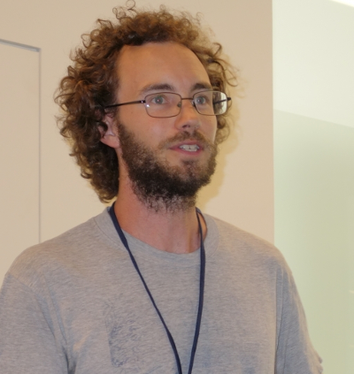]

[Dan Guest](https://github.com/dguest)

UC Irvine
]
]

<!-- https://indico.cern.ch/event/708041/contributions/3276174/attachments/1810633/2956920/ATL-SOFT-SLIDE-2019-073.pdf#page=2 -->
---
# Current HEP Computation

<br><br>

.grid[
.kol-1-2[
<br>
- Highly parallelizable
- Good for distributed, bulk computation
- Worldwide LHC Computing Grid (GRID) provides global infrastructure
   - Storage and compute
   - _Code goes to where the data is_
]
.kol-1-2[
.center.width-100[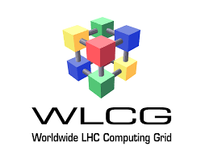]
]
]

<!-- https://indico.cern.ch/event/708041/contributions/3276174/attachments/1810633/2956920/ATL-SOFT-SLIDE-2019-073.pdf#page=2 -->
<!-- https://indico.cern.ch/event/791372/contributions/3286861/attachments/1783932/2903509/AML_Containers_Grid.pdf#page=3 -->
---
# Problem: Software Distribution

- Need to get the _runtime environment_ to data location

.center.width-100[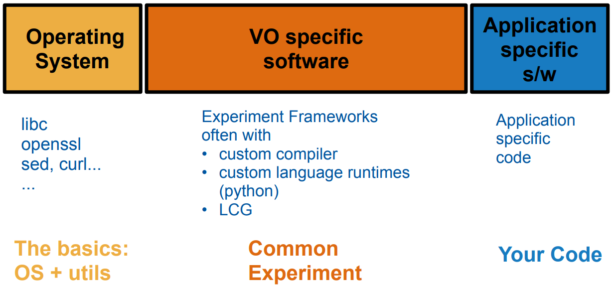]

- Relies on three parties to work (sys admins, experiments, users)
- Great for distributing crucial software, not for experimenting with new tools
- User only controls their code, upstream changes break reproducibility

---
# Containers
.grid[
.kol-2-3[
- _Machine Learning_ needs are challenge for current system
   - moves fast
   - experiments with bleeding edge tools
   - non-traditional HEP stack developed by industry
- Idea: Distribute software stack with _containers_
   - let the user assemble the full stack and optimize GRID for running containers
   - Host can be greatly simplified to core OS to run containers
]
.kol-1-3.center[
.center.width-50[]

.center.width-50[]
]
]
.center.width-100[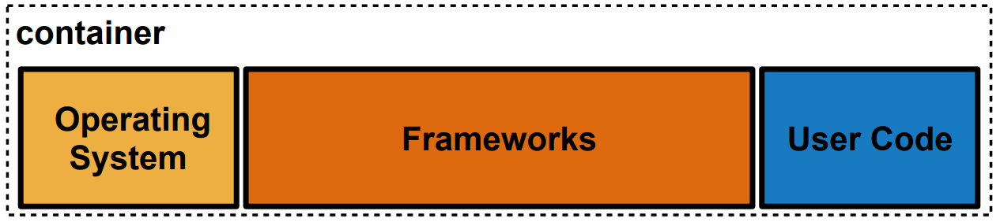]
.center[Docker Image (think: executable filesystem snapshot)]

<!-- https://indico.cern.ch/event/791372/contributions/3286861/attachments/1783932/2903509/AML_Containers_Grid.pdf -->
---
# Containers for ML

- ML applications currently one area that can realistically and usefully utilize hardware accelerators (GPUs)
- New HPC machines coming online ability to support HEP workloads
- Use of GPU requires _custom compiled software_
   - Example: TensorFlow GPU with CUDA
- With containers this is plug and play compute!

.center.width-100[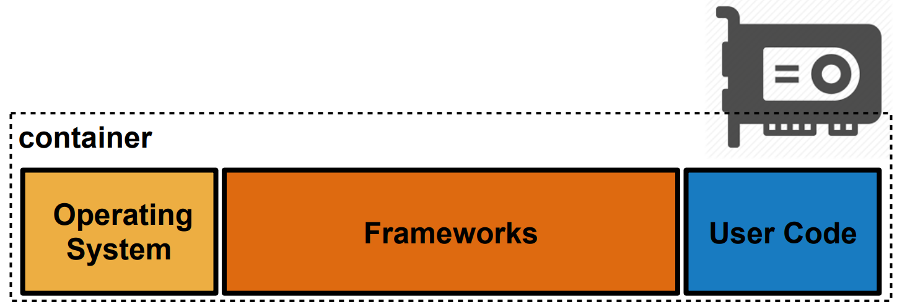]

---
# Containers for HEPML

- With containers can run large-scale jobs on WLCG infrastructure
   - hyperparameter scans
   - flavour tagging retraining

.grid[
.kol-2-3[
.center.width-100[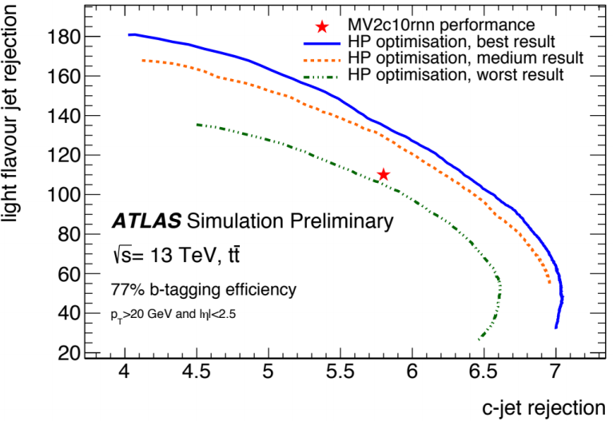]
.left[Flavour tagging ROC for hyperpameter scans <br>[[A. C. Forti, L. Heinrich, M. Guth, ACAT 2019](https://cds.cern.ch/record/2665661?ln=en)]]
]
.kol-1-3[
.center.width-110[[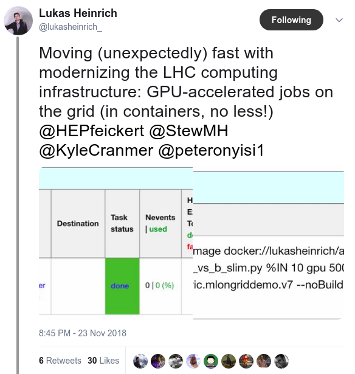](https://twitter.com/lukasheinrich_/status/1066055036197892098/photo/1)]
]
]

---
# Containers for HEPML

<br>

.center.width-100[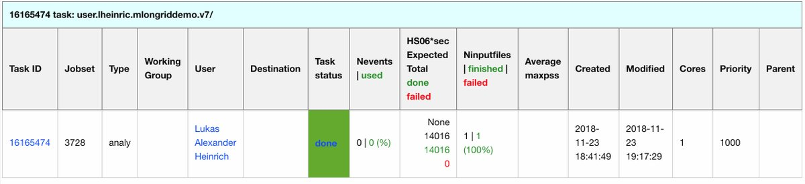]
.center[Flavour tagging hyperpameters scans on the GRID with containers]
<br>
.center.width-90[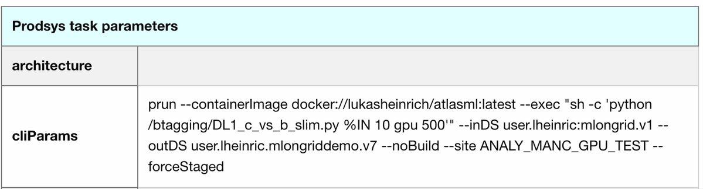]
.center[Submitted to GPU site at Manchester]

<!-- https://indico.cern.ch/event/708041/contributions/3276174/attachments/1810633/2956920/ATL-SOFT-SLIDE-2019-073.pdf#page=13 -->
<!-- https://carbon.now.sh/?bg=rgba(255%2C255%2C255%2C1)&t=seti&wt=none&l=application%2Fx-sh&ds=false&dsyoff=20px&dsblur=68px&wc=true&wa=true&pv=48px&ph=32px&ln=false&fm=Hack&fs=14px&lh=133%25&si=false&es=4x&wm=false&code=prun%2520%255C%250A%2520%2520--containerImage%2520docker%253A%252F%252F%253Cimage%253E%2520%255C%250A%2520%2520--exec%2520%2522%253Cshell%2520script%253E%2522%2520%255C%250A%2520%2520--inDS%2520%253Cinput%2520dataset%253E%2520%255C%250A%2520%2520--outDS%2520%253Coutput%2520dataset%253E%2520%255C%250A%2520%2520--outputs%2520%253Coutput%2520files%253E%2520%255C%250A%2520%2520--site%2520%253Csite%2520name%253E%2520%255C%250A%2520%2520--forceStaged -->
---
# User Interface

Integrated into main command line interface for GRID submission (PanDA):
.center.width-80[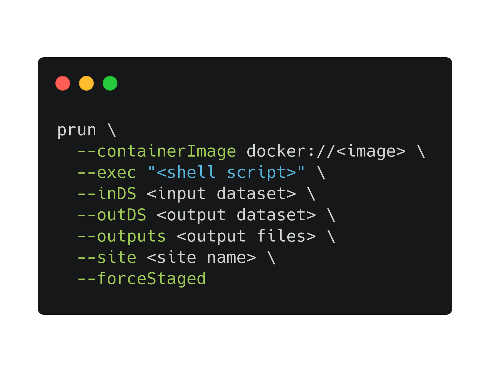]
In development/testing: dedicated _pcontainer_ CLI (drop all software related flags)

---
# Machine Learning Base Images
.grid[
.kol-1-3.center[
<br><br>
<br><br>
.center.width-100[]
]
.kol-2-3[
- [ML base images](https://hub.docker.com/r/atlasml/ml-base)
   - OS flavors
      - Ubutnu 18.04
      - CentOS 7
   - Goal: To provide _modern Pythonic_ machine learning stack, tools, environment
- [ATLAS ML base images](https://hub.docker.com/r/atlasml/atlasml-base)
   - Copying ATLAS Software Infrastructure Team to make stack of images
      - ATLAS OS (CentOS 7)
      - AnalysisBase (CentOS 7)
      - ATLAS ML base (CentOS 7)
   - Goal: Provide AnalysisBase and ATLAS tools along _with ML base_
]
]
- _Singularity compatible_ mount points for _GRID_
- Common ML tools and _starting image_ for personal ML workflows

---
# Base Image Development

.grid[
.kol-1-2.center[
.center.width-100[[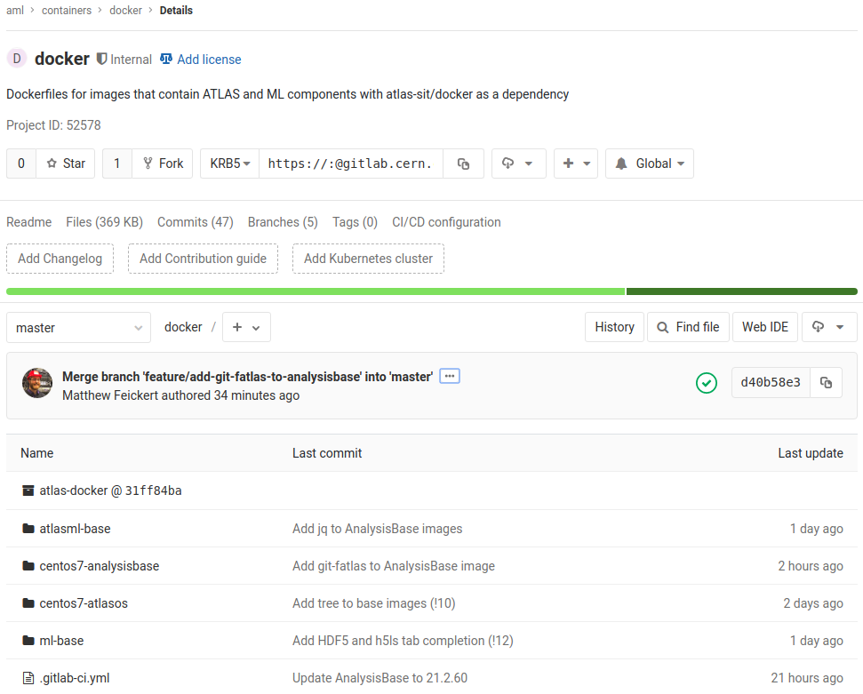](https://gitlab.cern.ch/aml/containers/docker)]
.center[[Dockerfiles versioned on GitLab](https://gitlab.cern.ch/aml/containers/docker)...]
]
.kol-1-2.center[
.center.width-80[[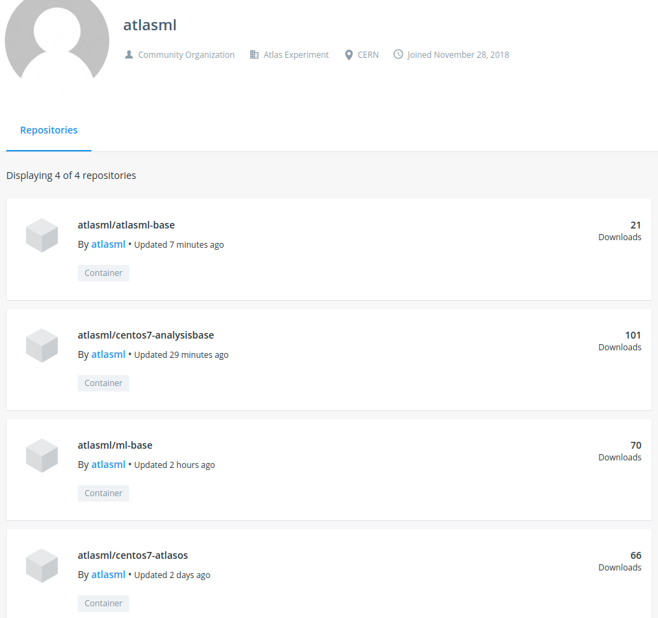](https://hub.docker.com/u/atlasml)]
.center[...and [deployed to Docker Hub](https://hub.docker.com/u/atlasml)]
]
]
.center.width-40[[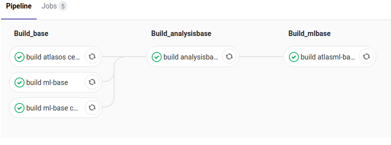](https://gitlab.cern.ch/aml/containers/docker/pipelines)]
.center[...[built by CI](https://gitlab.cern.ch/aml/containers/docker/pipelines)...]

---
# Base Image Environment
.center[Modern _Pythonic_ ML environment with common (HEP)ML tools]
.grid[
<!-- https://carbon.now.sh/?bg=rgba(255%2C255%2C255%2C1)&t=seti&wt=none&l=application%2Fx-sh&ds=false&dsyoff=20px&dsblur=68px&wc=true&wa=true&pv=48px&ph=32px&ln=false&fm=Hack&fs=14px&lh=133%25&si=false&code=%2524%2520python3%2520--version%250APython%25203.6.8%2520%2523%2520From%2520CPython%2520source%250A%2524%2520pip3%2520--version%250Apip%252019.0.3%250A%2524%2520cat%2520requirements.txt%2520%250Anumpy~%253D1.16%250Ascikit-learn~%253D0.20%250Atensorflow~%253D1.12%250Akeras~%253D2.2%250Atorch~%253D1.0%250Auproot~%253D3.4%250Amatplotlib~%253D3.0%250Apandas~%253D0.24%250Ajupyter~%253D1.0%250A&es=4x&wm=false -->
.kol-1-2.center[
.center.width-110[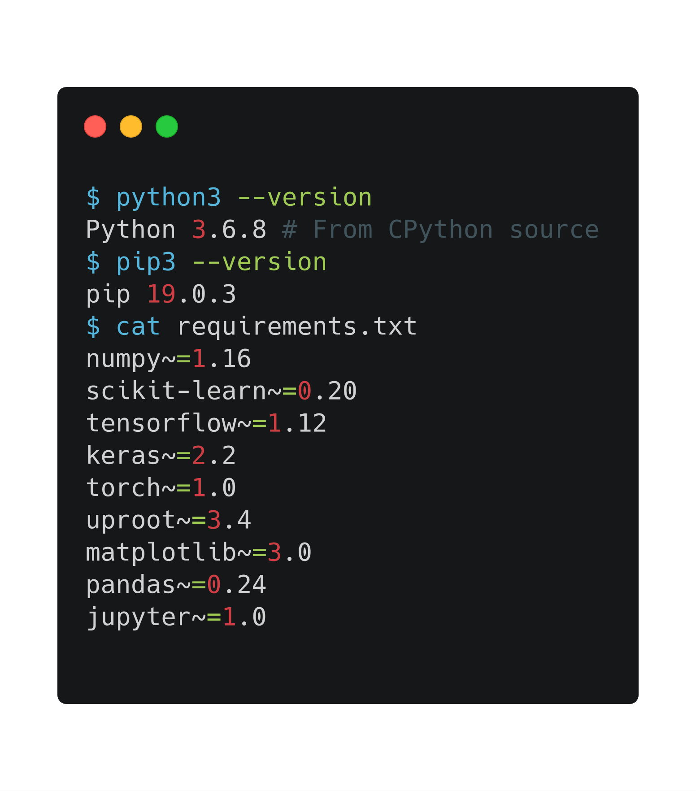]
]
<!-- https://carbon.now.sh/?bg=rgba(255%2C255%2C255%2C1)&t=seti&wt=none&l=application%2Fx-sh&ds=false&dsyoff=20px&dsblur=68px&wc=true&wa=true&pv=48px&ph=32px&ln=false&fm=Hack&fs=14px&lh=133%25&si=false&code=%2524%2520git%2520--version%250Agit%2520version%25202.17.1%250A%2524%2520h5ls%2520--version%250Ah5ls%253A%2520Version%25201.10.0-patch1%250A%2524%2520jq%2520--version%250Ajq-1.5%250A%2524%2520pip3%2520freeze%2520%257C%2520grep%2520h5py%250Ah5py%253D%253D2.9.0%250A%2523%2520and%2520more%250A&es=4x&wm=false -->
.kol-1-2.center[
.center.width-110[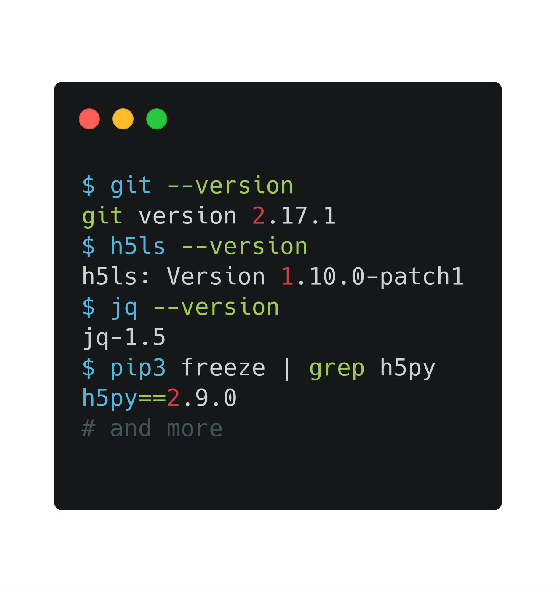]
]
]

---
# Supports Interactive Sessions
.center.width-80[[](https://gitlab.cern.ch/aml/containers/docker#run-a-jupyter-server-and-train-a-nn-with-tensorflow)]

---
# Upcoming: optimized images

.grid[
.kol-1-2[
## GPU
- Images with CUDA/cuDNN support for GPU acceleration
- GPU support for TensorFlow and PyTorch

## Size
- Slimmed and specialized base images for size optimization
   - Example: Don't distribute Jupyter if only want to train models on GRID
- In some cases can experiment with Alpine images to drop MBs of size
]
.kol-1-2[
.center.width-80[]

<br>

.center.width-80[]
]
]

---
# Summary

- HEPML needs non-traditional software stack. Served well by _containers_
- Containers allow for _local_ and _production_ to be the _same_ environment
- _GRID submission CLI_ of jobs with containers live now
- GRID + containers allows for unique workflows _at scale_ and _efficient use_ of GPU site resources
- ATLAS Machine Learning Forum provides _ML base images_ openly distributed on Docker Hub
   - Part of CVMFS sync, so on CVMFS now
   - Contributions welcome on [GitLab](https://gitlab.cern.ch/aml/containers/docker)

.grid[
.kol-1-2[
.center.width-100[]
]
.kol-1-2[
.center.width-100[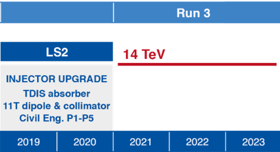]
]
]

---
class: end-slide, center

Backup

---
# How many WLCG sites support GPUs for hardware acceleration?

<br>

- At the moment 2
   - Manchester
   - DESY
- Looking to get more online soon given the results from collaboration between Lukas Heinrich (CERN) and Alessandra Forti (University of Manchester)!

---
# Do the images work on the WLCG?

- Yes! They can be used through Singularity as Lukas has shown for a few sites
- Checkout the `pcontainer` API

.center.width-60[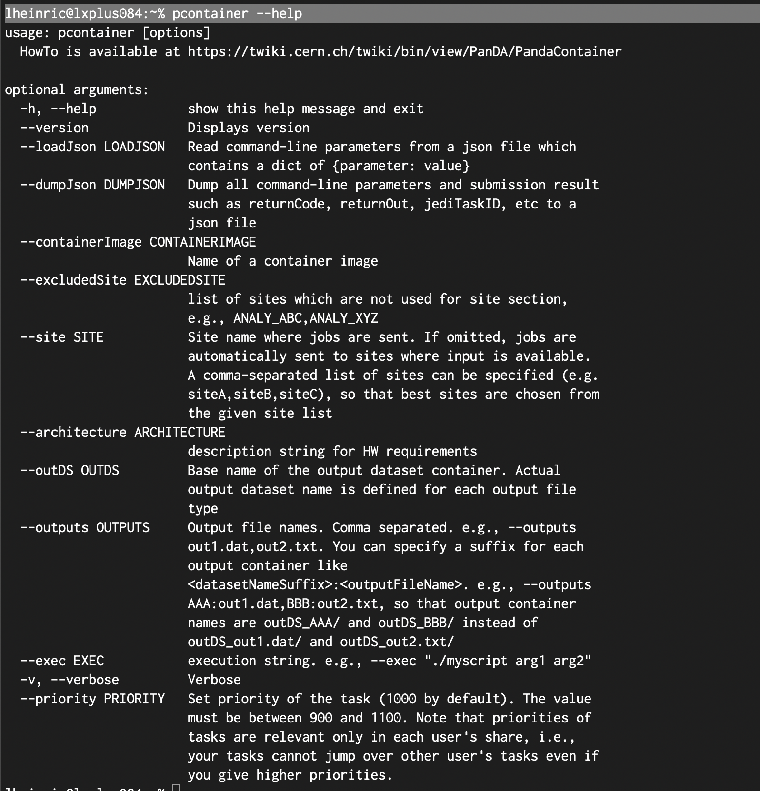]

---
# Does the WLCG support other container runtimes than Singularity?

<br>

- At time of this talk only Singularity is supported at most sites
- Active work to support other container runtimes (e.g., Docker (rootless), Podman)

---
# Can I use these base images to make my own images?

- Yes! That's the idea. :)
- Here's a minimal working example:
   - Write `Dockerfile`
```
FROM atlasml/ml-base:py-3.6.8
USER root
RUN pip3 install --no-cache-dir xgboost
USER atlas
```
   - Build and tag image
```
docker build -f Dockerfile -t xgboost-example --compress .
```
   - Run container
```
docker run --rm xgboost-example \
   python3 -c "import xgboost, uproot; print(xgboost, uproot)"
```
<!-- The above (python3) line contains empty unicode character and is not plaintext -->

---
# Do these base images work on LXPLUS?

<br>

- Yes! You can use Singularity to run the Docker images as Singularity containers
- See the documentation for examples: [Running on LXPLUS with Singularity](https://gitlab.cern.ch/aml/containers/docker#running-on-lxplus-with-singularity)

---
# References

1. L. Heinrich, .italic[[Continuous Analysis in ATLAS: Running User-Defined Container Images on the Grid](https://indico.cern.ch/event/708041/contributions/3276174/)], ACAT 2019, March 12, 2019
2. L. Heinrich, .italic[[Docker On the Grid](https://indico.cern.ch/event/791372/contributions/3286861/)], ATLAS Machine Learning Forum, January 23, 2019
3. A. C. Forti, L. Heinrich, M. Guth, .italic[[Hardware Accelerated ATLAS Workloads on the WLCG](https://cds.cern.ch/record/2665661?ln=en)], ACAT 2019, March 11, 2019
4. M. Feickert, .italic[[Base Images for Machine Learning](https://indico.cern.ch/event/791372/contributions/3286864/)], ATLAS Machine Learning Forum, January 23, 2019

---

class: end-slide, center
count: false

The end.
